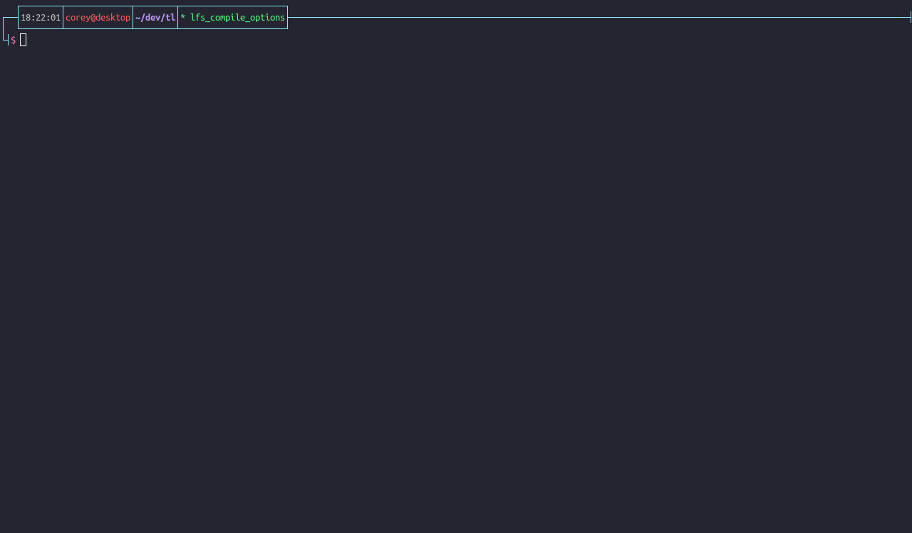

# teal-interactive.nvim

An interactive way of viewing Teal code and the generated Lua code side by side



### Installation
With Vim-Plug
```
Plug 'euclidianAce/teal-interactive.nvim'
```

Make sure that the `tl` module is accessible to your nvim installation.
(this includes having things like compat53 installed if necessary and knowing how nvim changes `package.path`)

### Usage

Just add one shortcut that calls `require("teal-interactive").initialize()`, for example
```
nnoremap <leader>teal lua require("teal-interactive").initialize()
```
Execute the keymap and your buffer will be split with the compiled output that you can navigate with ease.
